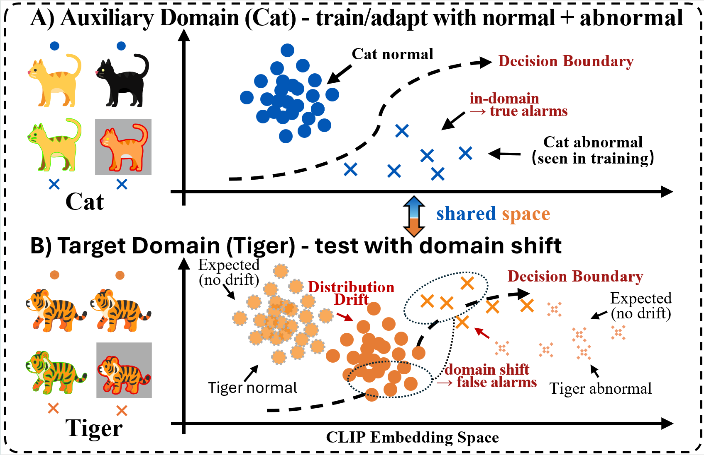

<div align="left"> 
<h1> 📌 SADC-Net </h1>
<h3>SADC-Net: Cross-Domain Anomaly Detection with Semantic Anchors and Drift Control</h3>
</div>


<div align="center">  </div>

<div align="justify">

## ⭐ Abstract 
Cross-domain anomaly detection is critical in real-world inspection, where a model adapted on an auxiliary domain must generalize to unseen target domains while producing reliable pixel-level anomaly maps. However, adapting vision–language models in this setting often suffers from two issues: (i) alignment drift and score mis-calibration, which destabilize the semantic reference of normality and degrade cross-domain detection; and (ii) a localization gap under domain shift, where dense similarity-based maps become noisy and inconsistent. We propose ContinueCLIP, a parameter-efficient framework that preserves the pre-trained cross-modal geometry by freezing the CLIP backbone, while enabling robust transfer via lightweight trainable components. ContinueCLIP stabilizes zero-shot calibration with shared semantic anchors, absorbs domain variations with minimal perturbation, and enhances dense localization through multi-level token aggregation coupled with a consistency constraint. When a few normal target samples are available, an optional non-parametric memory further improves score stability.

</div>

📴**Keywords**: Few-Shot, Large Vision-Language Model, Anomaly Classification and Segmentation

<div align="center">  </div>


## 🚀 Get Started

⚙️ Environment
- python >= 3.8.5
- pytorch >= 1.10.0
- torchvision >= 0.11.1
- numpy >= 1.19.2
- scipy >= 1.5.2
- kornia >= 0.6.1
- pandas >= 1.1.3
- opencv-python >= 4.5.4
- pillow
- tqdm
- ftfy
- regex

### Device
Single NVIDIA A40 GPU

## 📦 Pretrained model
- CLIP: https://openaipublic.azureedge.net/clip/models/3035c92b350959924f9f00213499208652fc7ea050643e8b385c2dac08641f02/ViT-L-14-336px.pt

    👉 Download and put it under `CLIP/ckpt` folder


## 🏥🏭 Medical and Industrial Anomaly Detection Benchmark

1. (optional) Follow the [BMAD](https://github.com/DorisBao/BMAD) to apply for permission to download the relevant dataset. 
2. We will provide the pre-processed benchmark. Please download the following dataset

    

3. Place it within the master directory `data` and unzip the dataset.

    ```
    tar -xvf Liver.tar.gz
    tar -xvf Brain.tar.gz
    tar -xvf Histopathology_AD.tar.gz
    tar -xvf Retina_RESC.tar.gz
    tar -xvf Retina_OCT2017.tar.gz
    tar -xvf Chest.tar.gz
    tar -xvf Mvtec.tar.gz
    tar -xvf MPDD.tar.gz
    tar -xvf BTAD.tar.gz
    ```


## 📂 File Structure
After the preparation work, the whole project should have the following structure:

```
code
├─ ckpt
│  ├─ few-shot
│  └─ zero-shot
├─ CLIP
│  ├─ bpe_simple_vocab_16e6.txt.gz
│  ├─ ckpt
│  │  └─ ViT-L-14-336px.pt
│  ├─ clip.py
│  ├─ model.py
│  ├─ models.py
│  ├─ model_configs
│  │  └─ ViT-L-14-336.json
│  ├─ modified_resnet.py
│  ├─ openai.py
│  ├─ tokenizer.py
│  └─ transformer.py
├─ data
│  ├─ Brain_AD
│  │  ├─ valid
│  │  └─ test
│  ├─ ...
│  └─ Retina_RESC_AD
│     ├─ valid
│     └─ test
├─ dataset
│  ├─ fewshot_seed
│  │  ├─ Brain
│  │  ├─ ...
│  │  └─ Retina_RESC
│  ├─ medical_few.py
│  └─ medical_zero.py
├─ loss.py
├─ prompt.py
├─ readme.md
├─ train_few.py
├─ train_zero.py
└─ utils.py

```


## ⚡ Quick Start

`python test_few.py --obj $target-object --shot $few-shot-number`

For example, to test on the Brain MRI with k=4, simply run:

`python test_few.py --obj Brain --shot 4`

### Training

`python train_few.py --obj $target-object --shot $few-shot-number`


## 🖼️ Visualization
<center></center>

## 🙏 Acknowledgement
We borrow some codes from [OpenCLIP](https://github.com/mlfoundations/open_clip), and [April-GAN](https://github.com/ByChelsea/VAND-APRIL-GAN).

## 📬 Contact

If you have any problem with this code, please feel free to contact **** and ****.

